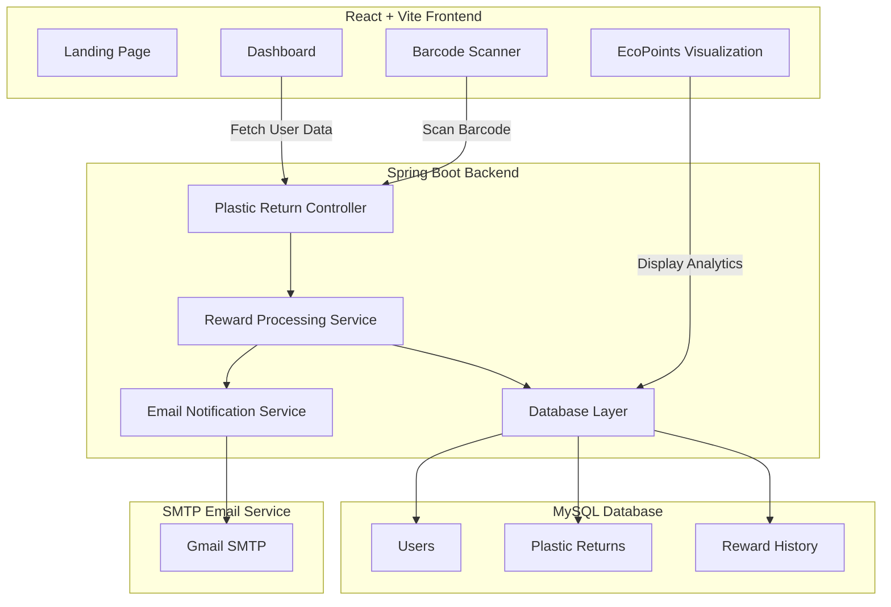
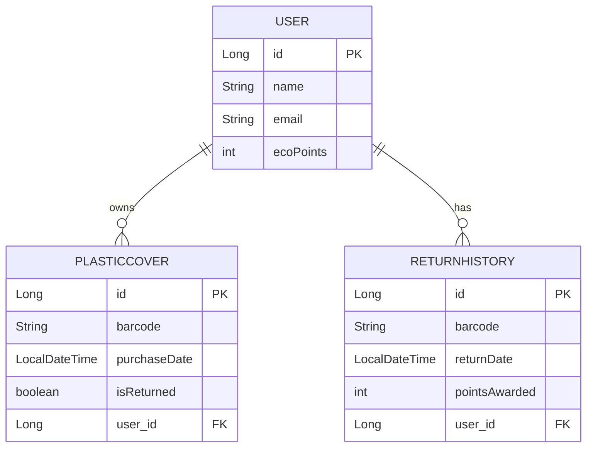

# ♻️ EcoReturn — Smart Plastic Return & Reward Ecosystem

> Turning sustainable habits into rewarding actions through intelligent recycling workflows.

EcoReturn is a full-stack sustainability platform designed to encourage responsible plastic disposal by rewarding users for returning recyclable plastic covers. The platform combines barcode scanning, automated reward tracking, email summaries, and analytics into a unified user experience.

Built using **Spring Boot**, **React**, and **MySQL**, EcoReturn simplifies plastic return management while promoting eco-conscious behavior through a gamified reward ecosystem.

---

## 📚 Table of Contents

- [🌍 Why EcoReturn?](#-why-ecoreturn)
- [🎯 Project Objectives](#-project-objectives)
- [🚀 Core Features](#-core-features)
- [💡 Existing Solutions vs EcoReturn](#-existing-solutions-vs-ecoreturn)
- [🧠 How EcoReturn is Different](#-how-ecoreturn-is-different)
- [🏗️ System Architecture](#️-system-architecture)
- [🗄️ Database Design](#️-database-design)
- [🔄 Workflow Overview](#-workflow-overview)
- [📂 Project Structure](#-project-structure)
- [⚙️ Backend Setup](#️-backend-setup)
- [📡 API Endpoints](#-api-endpoints)
- [⚛️ Frontend Setup](#️-frontend-setup)
- [🧪 Technology Stack](#-technology-stack)
- [📈 Key Benefits](#-key-benefits)
- [🚀 Future Enhancements](#-future-enhancements)
- [⚠️ Challenges Faced](#️-challenges-faced)
- [👥 Team — Neo Karma](#-team--neo-karma)
- [🏫 Institution](#-institution)
- [📬 Contributions & Feedback](#-contributions--feedback)
- [🌱 Vision](#-vision)
  
---

# 🌍 Why EcoReturn?

Plastic waste management remains one of the largest environmental challenges worldwide.

Although recycling systems exist, most users lack:

- Incentives for returning plastic waste
- Easy tracking mechanisms
- Transparent reward systems
- Accessible sustainability platforms

Traditional recycling systems are often manual, fragmented, and difficult to scale for everyday users.

EcoReturn addresses this problem by creating a **digital return-and-reward ecosystem** that motivates sustainable participation through automation and real-time tracking.

---

# 🎯 Project Objectives

The main objectives of EcoReturn are:

- Encourage responsible recycling behavior
- Digitize plastic return tracking
- Reward users with EcoPoints
- Reduce unmanaged plastic waste
- Build scalable sustainability-focused infrastructure
- Create a seamless recycling experience using modern web technologies

---

# 🚀 Core Features

## 📷 Barcode-Based Plastic Return

Users can scan plastic cover barcodes using:

- Webcam scanning
- QR/barcode reader
- Manual barcode entry

---

## 🎁 EcoPoints Reward System

For every successful return:

- EcoPoints are automatically awarded
- User reward balance updates instantly
- Return history is stored securely

---

## 📊 Smart Dashboard

Interactive dashboard providing:

- EcoPoints summary
- Return history tracking
- User activity insights
- Sustainability participation overview

---

## 📧 Automated Email Summaries

After each return session:

- Barcode summary is generated
- EcoPoints earned are displayed
- Email notifications are sent automatically

---

## 🗃️ Persistent Database Storage

MySQL-backed storage for:

- Users
- Returned plastic covers
- Reward history
- Transaction tracking

---

# 💡 Existing Solutions vs EcoReturn

| Existing Recycling Systems | EcoReturn |
|---|---|
| Mostly manual processes | Fully digital workflow |
| No reward mechanism | EcoPoints-based incentive model |
| Limited user engagement | Gamified sustainability approach |
| Fragmented tracking | Centralized dashboard |
| Minimal transparency | Real-time tracking & analytics |
| Difficult scalability | Modular full-stack architecture |

---

# 🧠 How EcoReturn is Different

EcoReturn is not just a recycling application.

It introduces:

- Reward-driven sustainability participation
- Real-time barcode validation
- Automated email-based engagement
- End-to-end digital return management
- Scalable architecture suitable for future smart-city integrations

The platform makes recycling interactive, trackable, and rewarding for everyday users.

---

# 🏗️ System Architecture



---

# 🗄️ Database Design



---

# 🔄 Workflow Overview


---

# 📂 Project Structure

```text
eco-return/
│
├── frontend/
│   ├── public/
│   ├── src/
│   │   ├── components/
│   │   ├── pages/
│   │   ├── services/
│   │   ├── App.jsx
│   │   └── main.jsx
│   ├── package.json
│   └── .env
│
├── backend/
│   ├── src/
│   │   ├── main/
│   │   │   ├── java/
│   │   │   └── resources/
│   │   └── test/
│   ├── pom.xml
│   └── target/
│
├── README.md
├── .gitignore
└── LICENSE
```

---

# ⚙️ Backend Setup

## 1️⃣ Create MySQL Database

```sql
CREATE DATABASE ecoreturn;
```

---

## 2️⃣ Configure Application Properties

Update:

```text
backend/src/main/resources/application.properties
```

```properties
spring.datasource.url=jdbc:mysql://localhost:3306/ecoreturn
spring.datasource.username=your_username
spring.datasource.password=your_password

spring.jpa.hibernate.ddl-auto=update
server.port=8080
```

---

## 3️⃣ Configure Email Service

```properties
spring.mail.host=smtp.gmail.com
spring.mail.port=587
spring.mail.username=your_email
spring.mail.password=your_app_password
```

---

## 4️⃣ Run Backend

```bash
cd backend
./mvnw spring-boot:run
```

Backend runs at:

```text
http://localhost:8080
```

---

# 📡 API Endpoints

| Method | Endpoint | Purpose |
|---|---|---|
| POST | `/api/scan` | Scan barcode image |
| POST | `/api/scan-barcode` | Manual barcode validation |
| GET | `/api/user` | Fetch user details |
| GET | `/api/return-history` | Fetch recycling history |
| POST | `/api/send-summary-email` | Send return summary |

---

# ⚛️ Frontend Setup

## Install Dependencies

```bash
cd frontend
npm install
```

---

## Configure Environment Variables

Create `.env`:

```env
VITE_API_URL=http://localhost:8080/api
```

---

## Start Frontend

```bash
npm run dev
```

Frontend runs at:

```text
http://localhost:5173
```

---

# 🧪 Technology Stack

| Category | Technologies |
|---|---|
| Frontend | React, Vite, Axios |
| Backend | Spring Boot, Java |
| Database | MySQL |
| Scanning | ZXing, react-qr-barcode-scanner |
| Email Service | JavaMail |
| Styling | CSS Modules |

---

# 📈 Key Benefits

✅ Encourages sustainable recycling behavior  
✅ Makes waste return trackable and transparent  
✅ Provides incentive-based engagement  
✅ Simple and accessible user workflow  
✅ Scalable for smart-city integrations  

---

# 🚀 Future Enhancements

- QR-code enabled smart recycling bins
- AI-based waste classification
- Mobile application support
- Leaderboards & gamification
- Recycling analytics dashboard
- Smart-city integration APIs

---

# ⚠️ Challenges Faced

- Barcode validation consistency
- Frontend-backend synchronization
- Email service configuration
- Real-time reward tracking
- User workflow optimization

---

# 👥 Team — Neo Karma

| Member | GitHub |
|---|---|
| Dorbala Sai Nikitha | [32732Nikitha](https://github.com/32732Nikitha) |
| Dorbala Sai Sujitha | [2300030861](https://github.com/2300030861) |
| Chennupalli Laxmi Varshitha | [LaxmiVarshithaCH](https://github.com/LaxmiVarshithaCH) |
| Chittelu Nissy | [2300030144](https://github.com/2300030144) |

---

# 🏫 Institution

**Koneru Lakshmaiah Education Foundation**  
Andhra Pradesh, India

---

# 📬 Contributions & Feedback

Suggestions, improvements, and pull requests are welcome.

If you'd like to contribute:

- Fork the repository
- Create a feature branch
- Submit a pull request
- Open an issue for improvements

---

# 🌱 Vision

EcoReturn envisions a cleaner and more sustainable future by transforming recycling into an engaging and rewarding digital experience.

### Return Plastic. Earn Rewards. Build Sustainability.
